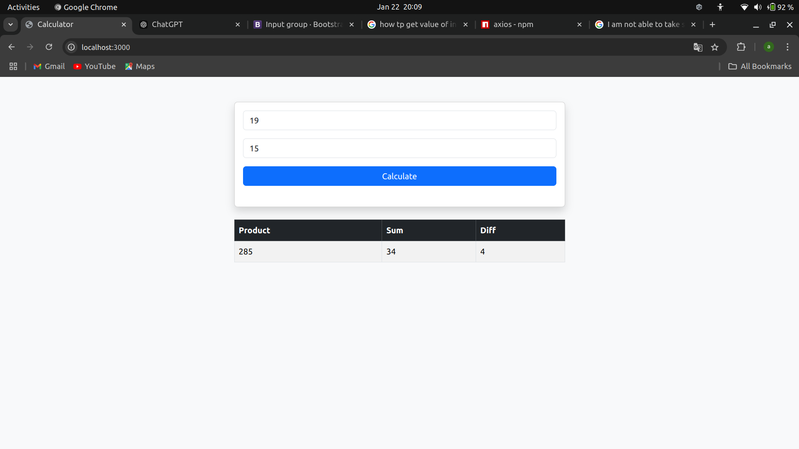

# Simple Calculator App

This is a simple web-based calculator application that performs basic arithmetic operations (sum, product, and difference) on two numbers. 

## Screenshots

### Home Page

## Features

- Accepts two numbers as input.
- Calculates the product, sum, and difference of the two numbers.
- Displays the results in a formatted table.
- Backend API built with Express.js to handle calculations.
- Open your browsers localhost:3000 to after launching the node server to access the application.

## Project Details

### Backend (`app.js`)
- **Endpoint**: `/calculate/:firstNumber/:secondNumber`
  - Accepts two numbers as URL parameters:
    - `firstNumber`: The first number for the calculation.
    - `secondNumber`: The second number for the calculation.
  - Responds with a JSON object containing after parsing URL parameters:
    - **`product`**: The product of the two numbers.
    - **`sum`**: The sum of the two numbers.
    - **`diff`**: The difference between the two numbers.

### Frontend (`index.html`)
- **Input Fields**: 
  - Two input fields for entering the numbers.
- **Submit Button**: 
  - A "Calculate" button triggers the API call to fetch results.
- **Results Table**:
  - Displays the results (Product, Sum, and Difference) in a neatly formatted table.
- **Technologies Used**:
  - **Axios** for making API requests to the backend.

### Example Workflow
1. Enter two numbers into the input fields provided.
2. Click the **"Calculate"** button.
3. The app sends a GET request './caculate/:firstNumber/:secondNumber' to the server at port 3000 API.
4. The server processes the numbers and sends back the results (product, sum, and difference).
5. The results are displayed in a table below the input form.